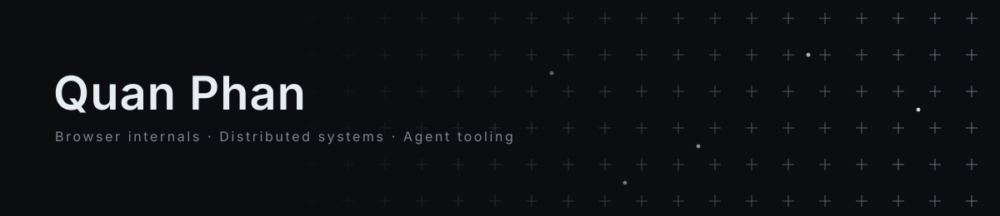

<picture>
  <source media="(prefers-color-scheme: dark)" srcset="./assets/banner.svg" />
  <source media="(prefers-color-scheme: light)" srcset="./assets/banner-light.svg" />
  
</picture>

<p align="center">
  <a href="mailto:dbui@ins-engineering.com"></a>&nbsp;
  <a href="https://github.com/phquand2000"></a>&nbsp;
  
</p>

---

<table>
<tr>
<td width="50%" valign="top">

### About Me

```yaml
role: Full-Stack Developer
company: LongWay Company
location: Hanoi, Vietnam
```

**Currently building:**
- Enterprise project management (TypeScript)
- Browser automation & extensions (C++)
- AI workflow tools (Python, n8n)
- Systems programming (Rust, Go)

</td>
<td width="50%" valign="top">

### Tech Stack

<p align="center">
  <a href="https://skillicons.dev">
    
  </a>
  <br/>
  <a href="https://skillicons.dev">
    
  </a>
</p>

</td>
</tr>
</table>

---

<p align="center">
  <picture>
    <source media="(prefers-color-scheme: dark)" srcset="https://streak-stats.demolab.com/?user=phquand2000&theme=github-dark-blue&hide_border=true&card_width=700" />
    <source media="(prefers-color-scheme: light)" srcset="https://streak-stats.demolab.com/?user=phquand2000&theme=default&hide_border=true&card_width=700" />
    
  </picture>
</p>

<p align="center">
  <picture>
    <source media="(prefers-color-scheme: dark)" srcset="https://raw.githubusercontent.com/phquand2000/phquand2000/output/github-snake-dark.svg" />
    <source media="(prefers-color-scheme: light)" srcset="https://raw.githubusercontent.com/phquand2000/phquand2000/output/github-snake.svg" />
    
  </picture>
</p>
