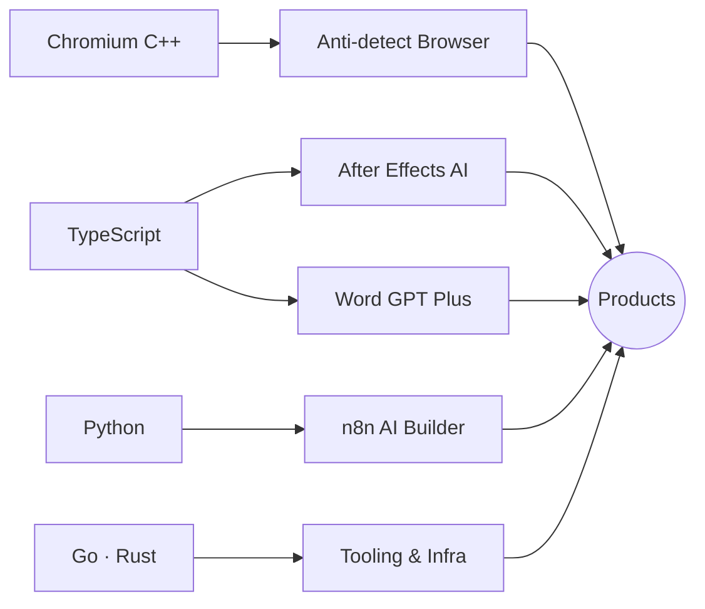

 

I build products at the intersection of **browser engineering**, **AI integration**, and **workflow automation** — from patching Chromium at the C++ level to shipping AI-powered creative tools.

Most of my work involves taking complex systems — browsers, video editors, document processors — and making them programmable through automation and AI agents.

`TypeScript` · `Python` · `C++` · `Go` · `Rust` 
`NestJS` · `React` · `Node.js` · `MySQL` · `Docker` · `Linux`

Hanoi, Vietnam

  

> [!NOTE]
> **Currently focused on:** anti-detect browser engine (Chromium C++, 46 patches) · AI-powered creative tools · enterprise workflow automation

 

<h3>Projects</h3>

 

**AI-Powered Tools**

&ensp; [**AE AI Assistant**](https://github.com/phquand2000/adobe_effects_ext) — CEP extension for After Effects: 29 services, 158 actions for AI-driven VFX automation

&ensp; [**Word GPT Plus**](https://github.com/phquand2000/docs_ext) — AI Agent integration into Microsoft Word with MCP server bridge

&ensp; [**n8n Premium**](https://github.com/phquand2000/n8n_folk_premium) — Enterprise n8n with custom AI Workflow Builder

 

**Browser & Systems**

&ensp; [**BlurShield**](https://github.com/phquand2000/BlurShield) — Privacy-focused screen blur shield tool

&ensp; [**INS Reports**](https://github.com/phquand2000/ins_reports_release) — Automated engineering report generation

&ensp; [**Learning Rust**](https://github.com/phquand2000/learning_rust) — Systems programming exploration

 

 

<h3>Activity</h3>

 

  <picture>
    <source media="(prefers-color-scheme: dark)" srcset="https://github-readme-activity-graph.vercel.app/graph?username=phquand2000&bg_color=0d1117&color=58a6ff&line=bc8cff&point=ffffff&area_color=1a1f2b&area=true&hide_border=true" />
    <source media="(prefers-color-scheme: light)" srcset="https://github-readme-activity-graph.vercel.app/graph?username=phquand2000&theme=minimal&hide_border=true&area=true" />
    
  </picture>

  <picture>
    <source media="(prefers-color-scheme: dark)" srcset="https://streak-stats.demolab.com/?user=phquand2000&theme=dark&hide_border=true&card_width=700&background=0d1117&stroke=30363d&ring=bc8cff&fire=bc8cff&currStreakLabel=58a6ff&sideLabels=58a6ff&currStreakNum=ffffff&sideNums=ffffff&dates=8b949e" />
    <source media="(prefers-color-scheme: light)" srcset="https://streak-stats.demolab.com/?user=phquand2000&theme=default&hide_border=true&card_width=700" />
    
  </picture>

  <picture>
    <source media="(prefers-color-scheme: dark)" srcset="https://raw.githubusercontent.com/phquand2000/phquand2000/output/github-snake-dark.svg" />
    <source media="(prefers-color-scheme: light)" srcset="https://raw.githubusercontent.com/phquand2000/phquand2000/output/github-snake.svg" />
    
  </picture>

